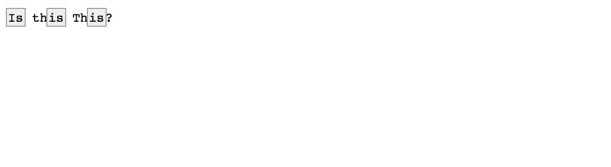

# regex-viewer 

A simple way to visually view regex expression results in a browser - only using node.js!

Under the covers, uses [cheeriojs](https://github.com/cheeriojs/cheerio) to do the HTML string manipulation

## Usage

#### Very simple.

```
// npm init
npm install regex-viewer --save
```

The just do your regex, and call this NPM module when you want to see a result

#### Example:

```
'use strict';

var viewer = require('regex-viewer');

var str = `Is this This?`;
var regex = /is/gi;

viewer(str, regex)
```

Note:  Fyi only, to quickly see this code run live, you can clone this repo, and run `npm run test`

#### Result.

The result.html file generated will automatically be opened using your default web browser




Done.